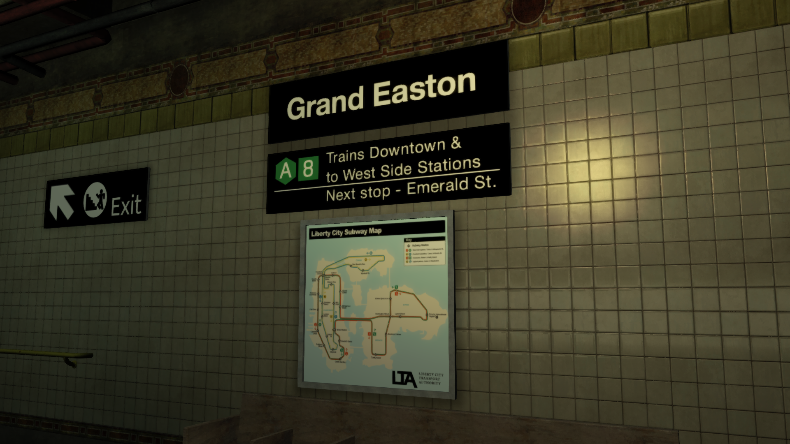

# LTA Subway Overhaul
A lore-friendly overhaul of Liberty City's subway system to faithfully resemble its real-life counterpart.

The goal of the mod is to provide a more immersive subway experience without breaking the game lore.

**Created and released in celebration for the [120th anniversary](https://ny1.com/nyc/all-boroughs/traffic_and_transit/2024/10/26/new-york-city-subway-celebrates-120th-anniversary) of the subway system.**

## Contents
- Replaced all subway signs that now captures the iconic NYC style
- Several stations were renamed to eliminate repetitive/duplicate names
- All subway audio announcements replaced
- Changed text strings to match NYC's subway nomenclature
- Removed black-and-white filter when entering trains
- [Retextured subway train to resemble the R38s](https://gtaforums.com/topic/994734-gta-iv-eflc-r38-subway/)
- Replaced subway train sounds with ones from the R38s

## Limitations/Issues
- Higher resolution textures used by the subway trains might trigger the taxi bug as soon a train spawns nearby, so vehicle budget value may need to be increased if you encounter the bug
- All subway trains have the same destination sign, which is 8 - Firefly Island

## Compatibility
- Works with any version of GTA IV (1.0.0.0 to 1.0.8.0, & CE)

## Requirements
- [FusionFix](https://gtaforums.com/topic/934545-fusionfix/) (for Fusion Overloader and vehicle budget value; CE users only)
- [OpenIV](https://openiv.com/) or [SparkIV](https://ahmed605.github.io/SparkIV/) (for installation; preCE users only)
- [RIL.Budgeted](https://gtaforums.com/topic/744584-reliv-rilbudgeted-population-budget-adjustertaxi-bug-fix/) (for vehicle budget value; preCE users only)

## Installation
- For CE users, download the archive and simply extract all of its contents into "update" folder
- Installation for preCE users is done manually, check readme for additional details

## Credits
- Sonik-hedgehog and ces for the authentic R38 subway sounds
-  Ash_735 for the remastered vanilla textures

## Source audio
- The source audio of the announcements can be [viewed and downloaded here](https://drive.google.com/file/d/1fzrWMjvo5oiZH2TTThMB8f4-GQWWXFQQ/view)
